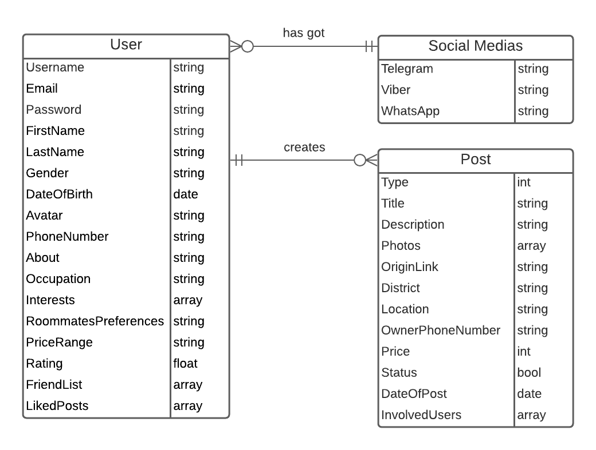

# App Architecture
## ER Diagram

## Component Diagram

## Scenarios
### Registration/Login
New users can register new profile using a unique username and password. New user will be added to the DB.
Users can login using their username and password. If they match with the ones in DB - user will enter.

### Personal Info
After registration users can fill their profile with some extra information and change any info in the profile whenever the user wants to. Data that user can add and change:
* Username;
* Password;
* First name;
* Last name;
* Date of birth;
* Gender;
* Avatar;
* Phone number;
* Social medias;
* About;
* Occupation;
* Interests;
* Roommate preferences.

### Editing Profile
Each user can edit their own profile.

### Adding posts
Each user can create posts of 2 available types:
1. Group gathering with intention to find and share a flat later on;
2. Searching for a roommate to join existing group which rents a particular flat.

Information which user can use in first type of posts:
* *Title;
* *Description;
* District;
* Location.

Information which user can use in second type of posts:
* *Title;
* *Description;
* *District;
* *Location;
* Photos of flat;
* Flat owner's phone number;
* External link to rented flat.

### Editing posts
Each user can edit their own posts.

### Deleting posts
Each user can delete their own posts.

### Friend Request
Each user can send a friend request to another user. If he accepts his request - they’ll appear in each one’s friend list.

### Delete Friends
Each user can delete their friends.

### Like posts
Each user can like posts so creators can see them as involved.

### Unlike posts
Each user can unlike posts if they aren’t involved anymore.